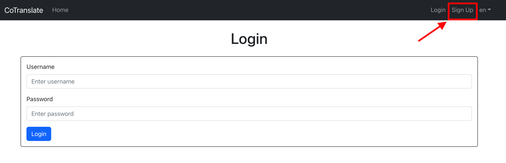
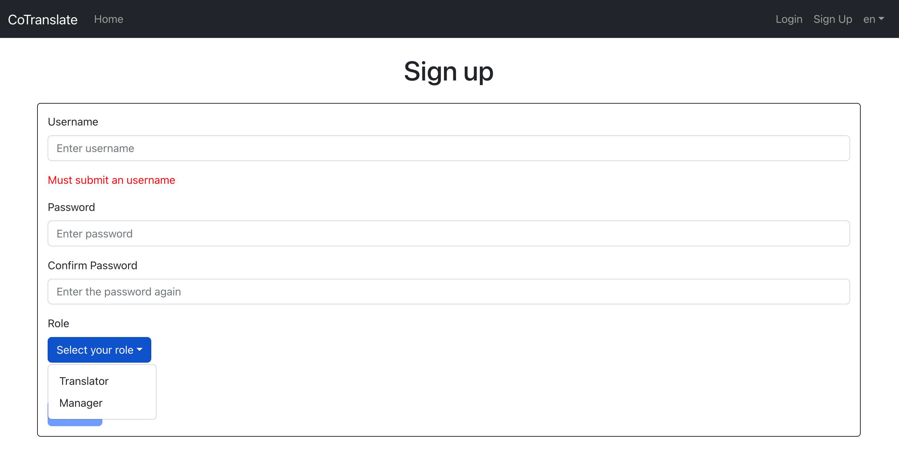
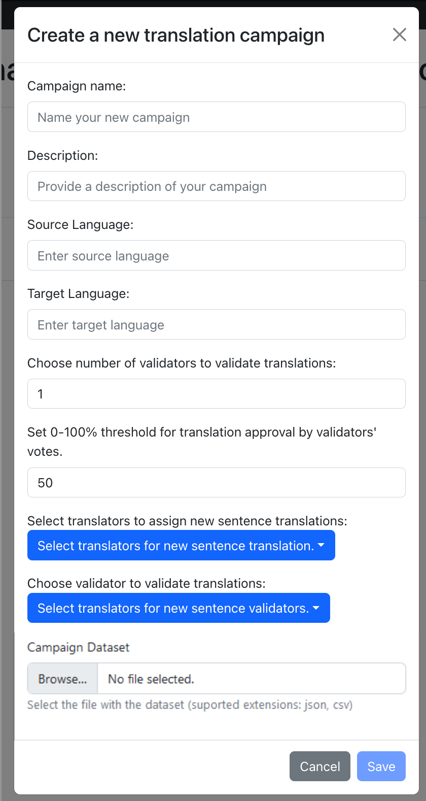

--------------------------------------------------------------------------------------------------------
CoTranslate: A Web-Based Tool for Crowdsourcing High-Quality Sentence Pair Corpora
-------------------------------------------------------------------------------------------------------------------------------
Introduction
-------------------------------------------------------------------------------------------------------------------------------

CoTranslate is a web-based platform designed to efficiently label and review translations from language experts, with the aim of creating high-quality sentence-pair corpuses for training neural machine translation models. Utilizing Django backend and ReactJS frontend, the platform fosters collaboration among experts in translating and validating sentences. Focused on developing quality corpora, particularly for low-resource languages, CoTranslate addresses linguistic barriers and enhances translation quality. By streamlining the creation of robust training datasets, CoTranslate holds significant potential to impact the field of machine translation.

CoTranslate has the following capabilities:  

1. Manager and labeler profile for creating,reviewing and completing campaigns.

2. Supports translation and validation based on a dataset uploaded by the manager user.

-------------------------------------------------------------------------------------------------------------------------------
Project Structure
-----------------------------------------------------------------------------------------------------------------------------

First: `/backend` Backend Configuration (Django Application)

1. settings.py: Set up backend configurations.
2. urls.py: Establish backend URL patterns.

Second: `/labelingPlatform` Labeling Platform Setup (Django Application)

1. admin.py: Define the platform's admin class and functions.
2. models.py: Create classes for profiles, campaigns, campaign items, and their features and functions.
3. serializers.py: Link Django models and media storage to the client, converting complex information to local Python data types.
4. urls.py: Specify app URLs.
5. views.py: Create views for application classes, such as campaign creation, review, validation, and translation.

Third: `/frontend` Frontend Development (ReactJS)

1. src/components: Include components like footer, headerNavBar, CreateEditCampaign, Campaign review, and Campaign statistics.
2. src/context: Store authorization tokens for different user profiles.
3. src/lang: Store English and Spanish texts for the application to display on the frontend.
4. src/views: Design views for pages like campaign, home, item translation, item validation, login, manager, signup, and tagger.
5. src/App.js: Launch the frontend app.

-------------------------------------------------------------------------------------------------------------------------------
CoTranslate local server setup
-----------------------------------------------------------------------------------------------------------------------------

## Frontend:

1. Install [NodeJS]

2. Inside the `frontend` directory, install dependencies by running the following command in the terminal:

        npm i

3. Inside the `frontend` directory, build the application by running the following command in the terminal:

        npm run build

4. Launch the `frontend` by running the following command in the terminal within the `./frontend` directory: 

         npm start

5. Access the frontend of the platform from React by visiting:  
		
		127.0.0.1:3000 

## Backend:
1. Install [Python 3.10]

2. Create and active a virtual environment:

        * [Python venv]
        * [Miniconda3 env] 

3. Install dependencies by running the following command in the terminal:

        pip install -r requirements.txt

4. Migrate models and generate the database:

        python manage.py makemigrations labelingPlatform
        
        python manage.py makemigrations
        
        python manage.py migrate labelingPlatform
        
        python manage.py migrate

 5. Generate the `static` directory with the platform's frontend:

        python manage.py collectstatic

6. Create a `superuser` to manage the platform:

        python manage.py createsuperuser

7. Run the application:

       python manage.py runserver
    
8. Access the platform by navigating to: 
    
        127.0.0.1:8000
    
9. Access the admin panel by navigating to: 
    
    	127.0.0.1:8000/admin/
   

[Python 3.10]: https://www.python.org/downloads/
[Python venv]: https://docs.python.org/3/library/venv.html
[Miniconda3 env]: https://conda.io/projects/conda/en/latest/user-guide/tasks/manage-environments.html
[Miniconda3]: https://docs.conda.io/en/latest/miniconda.html
[NodeJS]: https://nodejs.org/en/download/

-------------------------------------------------------------------------------------------------------------------------------
CoTranslate Google App Engine setup
-----------------------------------------------------------------------------------------------------------------------------

* The platform is deployed on Google App Engine and uses `Cloud SQL - PostgreSQL 14`. To view the entire process and the steps followed when deploying the platform on `Google App Engine`, it is recommended to read the official Google Cloud documentation: `https://cloud.google.com/python/django/` appengine (in summary, an App Engine instance was created and configured, a Cloud SQL instance was created and configured, a secret was set up within GCP's Secret Manager to store an `.env` file with Cloud SQL instance data, and the local environment was configured to access the mentioned services)

* Connecting locally to the platform deployed on Google App Engine allows deploying changes made to the platform, both in the backend and the frontend.

1. Install [Google Cloud CLI].

2. Run the gcloud init command and sign in with the Google account associated with the cenia project in Google Cloud. Choose the cenia-labeling-platform project and do not configure the default Compute Zone/Region.

3. Run the command
`gcloud auth application-default login`
to acquire credentials and communicate with the API and Cloud SQL instance.

4. Download the Cloud SQL Auth Proxy by running the command
curl -o cloud-sql-proxy `https://storage.googleapis.com/cloud-sql-connectors/cloud-sql-proxy/v2.0.0/cloud-sql-proxy.linux.amd64`

5. Make the Cloud SQL Auth Proxy executable by running the command
`chmod +x cloud-sql-proxy`
(it may be necessary to run it with administrator permissions).

6. Start the Cloud SQL Auth Proxy by running the command
`./cloud-sql-proxy coTranslate:southamerica-east1:coTranslate-platform-admin`

7. In a second terminal, export the project ID as an environment variable:
export `GOOGLE_CLOUD_PROJECT=coTranslate`
and export a variable to indicate that you want to use the Cloud SQL environment:
`export USE_CLOUD_SQL_AUTH_PROXY=true`

8. In the same terminal used in `7`, follow the instructions in point `2`. Prepare the backend up to step 5 (including it) to migrate the models to the Cloud SQL database. (You can also create a superuser to access the Django control panel in Cloud SQL)

9. Run python manage.py runserver within the main directory to serve the backend at `127.0.0.1:8000`. If you have followed steps 6 and 7, the DEBUG variable in the `./backend/settings.py` file will be set to False and the backend will connect directly to the instance deployed in the cloud using Cloud SQL (in this case, you will need to launch the frontend to view the application, you can force a `DEBUG=True` variable within `settings.py` if you want to access the app directly from the backend), otherwise, it will run in a local environment using SQLite3 (default Django configuration with `DEBUG=True`).

10. Launch the frontend locally following steps 1 and 4 in the Access the platform locally section to test local changes on the platform.

11. To reflect changes made to the platform in the local environment on the platform deployed on GCP (so they are visible when accessing using the link shown at the beginning), establish the connection with GCP (steps 6 and 7).

* If you want to migrate changes made to the backend, you need to execute the commands mentioned in point 2.4 of the Access the platform locally section.

* This will directly update the schemas and models of the database in the cloud.

* If you want to migrate changes made to the frontend, you need to run the npm run build command inside the `./frontend` directory and then the python manage.py collectstatic command inside the root directory of the platform.

* Finally, you need to run the gcloud app deploy command within the platform's root directory to copy all project files to the cloud and execute the platform from the `app.yaml` file.

-------------------------------------------------------------------------------------------------------------------------------
Getting Started with the CoTranslate Language Translation Platform
-----------------------------------------------------------------------------------------------------------------------------
After starting the application in `backend` and `frontend`: 

1. **Sign up:** Click on the "Sign up" button as shown in the screenshot below:

2 . **Register your profile:** Fill in the required information to register your profile, and choose your role as either a Translator/Validator or Manager.

3 . **Create a campaign:** If you have registered as a Manager, sign in with your Manager profile. Next, create a new campaign by providing the following information: campaign name, description, source language, target language, number of validators, approval threshold, assigned translators, assigned validators, and upload the sentence-pairs dataset. An example dataset can be found in `sample_dataset/sample_dataset.csv`.

4 . **Begin translating:** If you have registered as a Translator, sign in with your Translator profile and start working on translations assigned to you.

[Google Cloud CLI]: https://cloud.google.com/sdk/docs/install
[Google App Engine]: https://cloud.google.com/python/django/appengine#run-locally
